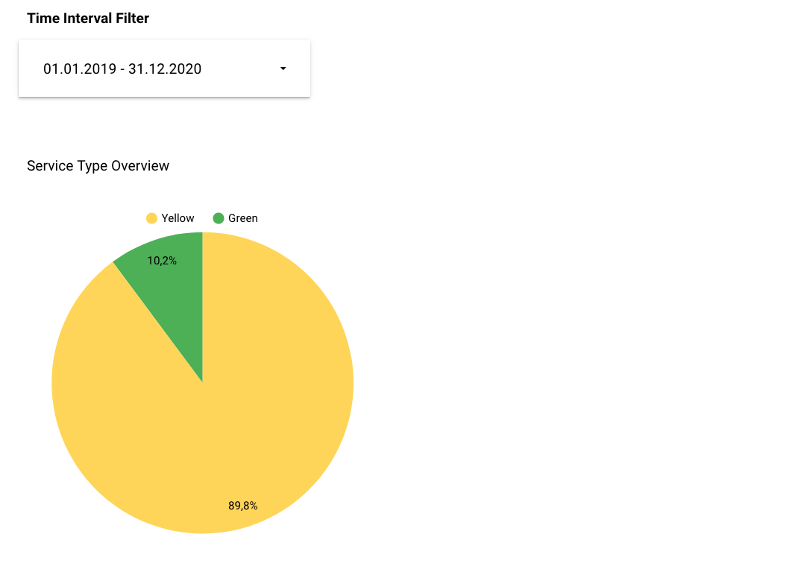
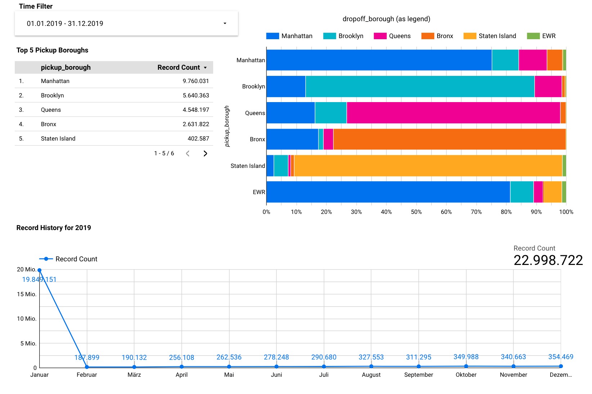

## Week 4 Homework 

In this homework, we'll use the models developed during the week 4 videos and enhance the already presented dbt project using the already loaded Taxi data for fhv vehicles for year 2019 in our DWH.

We will use the data loaded for:
* Building a source table: stg_fhv_tripdata
* Building a fact table: fact_fhv_trips
* Create a dashboard 

If you don't have access to GCP, you can do this locally using the ingested data from your Postgres database
instead. If you have access to GCP, you don't need to do it for local Postgres -
only if you want to.

Usefull website for this data is: https://www.nyc.gov/site/tlc/about/industry-reports.page

### Question 1: 
**What is the count of records in the model fact_trips after running all models with the test run variable disabled and filtering for 2019 and 2020 data only (pickup datetime)**  
You'll need to have completed the "Build the first dbt models" video and have been able to run the models via the CLI. 
You should find the views and models for querying in your DWH.

Solution:
I created a production deployment with --vars 'is_test_run: false' and started a run with the yellow and green model. Then run a query:

```sql
SELECT COUNT(*) as number_of_records
FROM `ringed-enigma-376110.production.fact_trips`
WHERE EXTRACT(YEAR FROM pickup_datetime) BETWEEN 2019 AND 2020
```
result: 61'540'555

### Question 2: 
**What is the distribution between service type filtering by years 2019 and 2020 data as done in the videos**

I used google data studio and set a time interval filter:



Link to dashboard: https://lookerstudio.google.com/reporting/8a13d6c2-fd0a-4ebe-94b2-d41da403dfc1


### Question 3: 
**What is the count of records in the model stg_fhv_tripdata after running all models with the test run variable disabled (:false)**  

Create a staging model for the fhv data for 2019 and do not add a deduplication step. Run it via the CLI without limits (is_test_run: false).
Filter records with pickup time in year 2019.

I used the data dictionary for fhv trip data from here: https://www.nyc.gov/assets/tlc/downloads/pdf/data_dictionary_trip_records_fhv.pdf

After creating the model i build the model with `dbt build --select stg_fhv_tripdata --vars 'is_test_run: false'`

```sql
SELECT COUNT(*) as record_count
FROM `ringed-enigma-376110.dbt_jbechthold.stg_fhv_tripdata` 
WHERE EXTRACT(YEAR FROM pickup_datetime) = 2019
```
result: 43'244'696

### Question 4: 
**What is the count of records in the model fact_fhv_trips after running all dependencies with the test run variable disabled (:false)**  

Create a core model for the stg_fhv_tripdata joining with dim_zones.
Similar to what we've done in fact_trips, keep only records with known pickup and dropoff locations entries for pickup and dropoff locations. 
Run it via the CLI without limits (is_test_run: false) and filter records with pickup time in year 2019.

After creating the model i build the model with `dbt build --select fact_fhv_trips --vars 'is_test_run: false'`

```sql
SELECT COUNT(*) as record_count
FROM `ringed-enigma-376110.dbt_jbechthold.fact_fhv_trips` 
WHERE EXTRACT(YEAR FROM pickup_datetime) = 2019
```
result: 22'998'722

### Question 5: 
**What is the month with the biggest amount of rides after building a tile for the fact_fhv_trips table**
Create a dashboard with some tiles that you find interesting to explore the data. One tile should show the amount of trips per month, as done in the videos for fact_trips, based on the fact_fhv_trips table.

Query for doing the analysis in BigQuery:

```sql
SELECT
EXTRACT(MONTH FROM pickup_datetime) as month,
COUNT(*) as record_count_month
FROM `ringed-enigma-376110.dbt_jbechthold.fact_fhv_trips` 
WHERE EXTRACT(YEAR FROM pickup_datetime) = 2019
GROUP BY month
ORDER BY month
```
result: january (1) with 19'849'151 this is much more than all the other months together.



Link to dashboard: https://lookerstudio.google.com/reporting/cf5a7d04-cba8-4a96-891e-08dcfa9f4815
