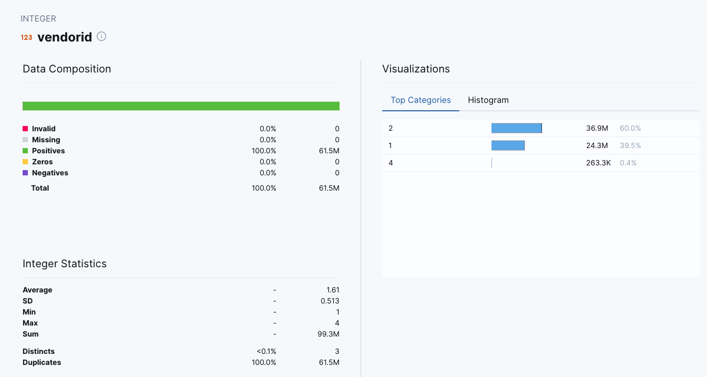
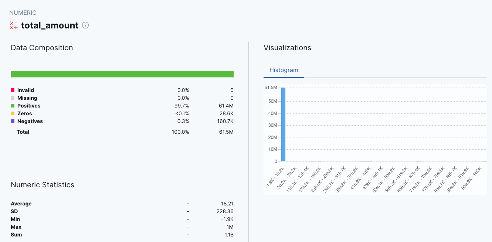
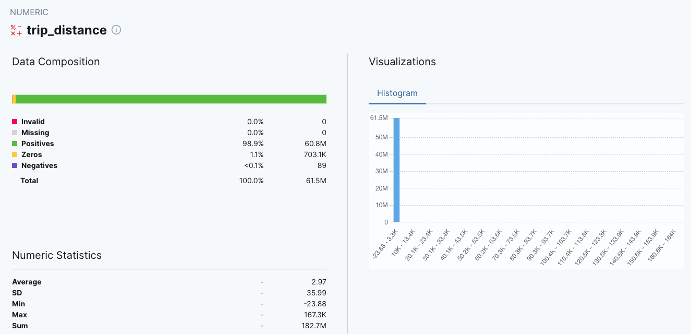

## Homework

The following questions follow on from the original Week 4 homework, and so use the same data as required by those questions:

https://github.com/DataTalksClub/data-engineering-zoomcamp/blob/main/cohorts/2023/week_4_analytics_engineering/homework.md

Yellow taxi data - Years 2019 and 2020
Green taxi data - Years 2019 and 2020
fhv data - Year 2019.

## Preqeuqisites

I followed the instructions here to setup and test dbt Core locally and setup the connection to GoogleBigQuery

https://docs.getdbt.com/docs/get-started/getting-started-dbt-core

Basicall it is similar as shon in the workshop video:

1. install dbt bigquery: `pip install dbt-bigquery`
2. install piperider for bigquery: `pip install 'piperider[bigquery]'`

For the BigQuery connection a profiles.yml file muste be created in the `~/.dbt`folder with details to BiqQuery Database connection such as service account json file and the profile muste be named. In this case, I used `jonas_bq` as profile name. After this the BigQuery connection can be tested with `dbt debug`

Is this workes fine, the BQ connection can be used.

Afterwards I cloned the repo of week 4 and made some changes in this repo here: https://github.com/jb-ds2020/taxi_dbt_piperider

In the dbt repo for piperide, the `dbt_project.yml` the profile name must be changed from `profile: 'default'` (cbt cloud default value from week for) to `profile: 'jonas_bq'`

Finally I added a line to filter the `fact_trips.sql` model to anly user pickup dates from 2019 and 2020:

`where EXTRACT(YEAR FROM trips_unioned.pickup_datetime) = 2019 OR EXTRACT(YEAR FROM trips_unioned.pickup_datetime) = 2020`

Then the steps are the same as in the tutorial:

1. switch to a new branch: `git switch -c taxipiperider`
2. `dbt deps`
3. `dbt build --var 'is_test_run: false'` to allow the full dataset to be processed (otherwise only 100 rows will be processed)
4. `piperider init`
5. `piperider run`

and finally open the report under: `.piperider/outputs/latest/index.html`, which gives answers to the following questions by using the fact_trips table and clicking on the wanted column to show the data composition.

### Question 1:

What is the distribution between vendor id filtering by years 2019 and 2020 data?

You will need to run PipeRider and check the report

* 60.1/39.5/0.4

result: 
2 - 36.9M -> 60%
1 - 24.3M -> 39.5%
4 - 263.3k -> 0.4%

### Question 2:

What is the composition if total amount (positive/zero/negative) filtering by years 2019 and 2020 data?

You will need to run PipeRider and check the report

* 61.4M/25K/148.6K

result are slightly different:
Positives 61.4M
Zeros 28.6k
Negatives 160.9k

### Question 3:

What is the numeric statistics (average/standard deviation/min/max/sum) of trip distances filtering by years 2019 and 2020 data?

You will need to run PipeRider and check the report

* 2.95/35.43/-23.88/167.3K/181.5M

result:

Average: 2.97
SD: 35.99
Min: -23.88
Max: 167.3k
Sum: 182.7M

## Submitting the solutions

* Form for submitting: https://forms.gle/WyLQHBu1DNwNTfqe8
* You can submit your homework multiple times. In this case, only the last submission will be used. 

Deadline: 13 March, 22:00 CET

## Solution

We will publish the solution here
